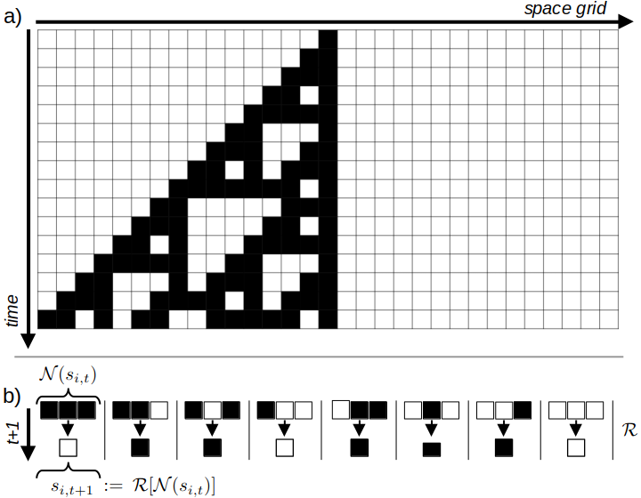
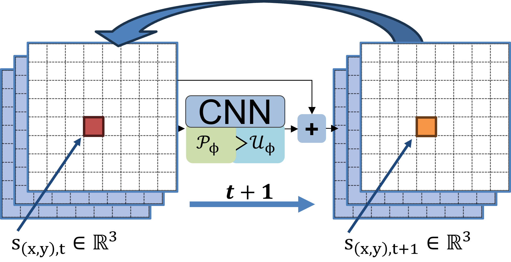
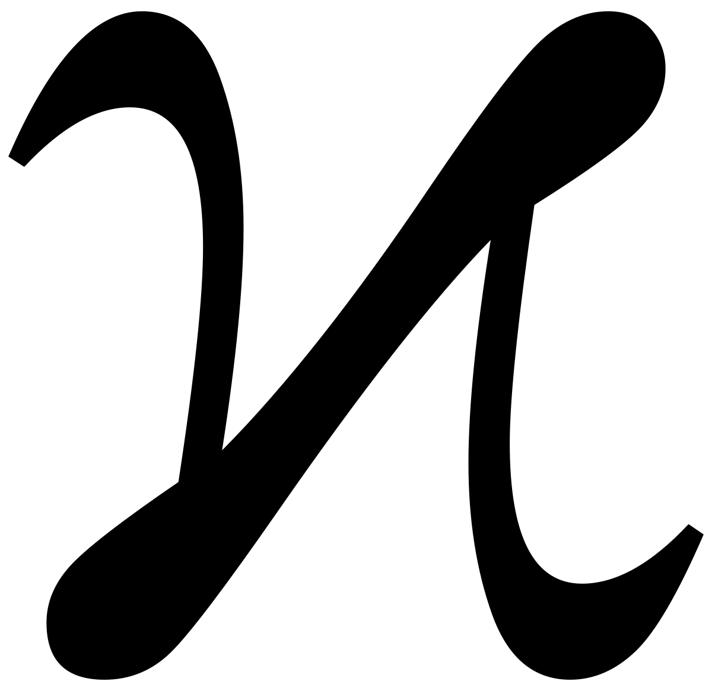

## A New Kind of Network?

*Stephen Wolfram* proclaimed in his 2003 seminal work ***A New Kind Of Science*** that simple recursive programs in the form of ***Cellular Automata (CA)*** are a promising approach to replace currently used mathematical formalizations, e.g. differential equations, to improve the modeling of complex systems.

Over two decades later, while Cellular Automata have still been waiting for a substantial breakthrough in scientific applications, recent research showed new and promising approaches which combine **Wolfram's** ideas with learnable Artificial Neural Networks: So-called ***Neural Cellular Automata (NCA)*** are able to learn the complex update rules of CA from data samples, allowing them to model complex, self-organizing generative systems.

### Table of Content 
* [Cellular Automata](#cellular-automata)
* [Neural Cellular Automata](#neural-cellular-automata)
* [NCAtorch PyTorch Library](#ncatorch) 


## Cellular Automata
*Cellular Automata* (CA) have been a subject of study since the 1940s, notably by *John von Neumann* ([von Neumann, 1966](https://cba.mit.edu/events/03.11.ASE/docs/VonNeumann.pdf)) and others. At its core, *Cellular Automata* are discrete computational models, which consist of a finite, regular grid $\mathcal{G}$ of discrete cells. Each cell holds a discrete state $s_{i,t}$ at a given discrete time-step $t$.


| **A simple 1D CA Example** |
| --- |
|  |
| **Visualization of a simple, 1D CA with binary states.** **a)** shows the recursive update of grid states over time by applying the update rules $\mathcal{R}$ on the $3 \times 1$ cell neighborhoods shown in **b)**. |

As time progresses, cell states are updated recursively and synchronously across all cells, based on a set of rules $\mathcal{R}$ that utilize the local neighborhood $\mathcal{N}(s_{i,t})$ to calculate the new cell state: $s_{i,t+1}:=\mathcal{R}[\mathcal{N}(s_{i,t})]$ (Schiff, 2011). Figure 1 shows the computation process and rules for a basic CA with binary states ($s_{(x,y),t} \in \{0,1\}$).

*Cellular Automata* gained significant public recognition in the 1970s through *Conway's "Game of Life"* ([Conway, 1970](https://www.semanticscholar.org/paper/Game-of-Life-Izhikevich-Conway/69cba987e35cf58576e14d12ca6ccf830c9a472b)). This game employed a binary *Cellular Automaton* on a two-dimensional grid and update-rules based on a $3 \times 3$ neighborhood.

#### **Applications and Theoretical Significance**

Subsequent research demonstrated the broad applicability of CAs, including their use in *biological* ([Bouligand, 1986](https://link.springer.com/chapter/10.1007/978-3-642-82657-3_36); [Coombes, 2009](https://www.maths.nottingham.ac.uk/plp/pmzsc/pdfs/Seashells09.pdf); Hatzikirou, 2012), *chemical* ([Gerhardt, 1989](https://www.sciencedirect.com/science/article/abs/pii/016727898990081X), and *physical modeling* ([Wolfram, 1983](https://content.wolfram.com/sw-publications/2020/08/statistical-mechanics-cellular-automata.pdf); [Zaluska, 2021](https://www.mdpi.com/2073-4352/11/9/1135)). Furthermore, certain CA configurations were shown to possess powerful theoretical computing properties, such as *Turing Completeness* ([Cook, 2004](https://wpmedia.wolfram.com/sites/13/2018/02/15-1-1.pdf)) of certain CA configurations, thus establishing CAs as a *universal computing model*.

This theoretical strength led *Stephen Wolfram* to propose his well-known work, ***"A New Kind Of Science"*** ([Wolfram, 2003](https://www.wolframscience.com/nks/)). In it, he suggested that inherently limited mathematical formulations could be replaced by more powerful *"simple programs"* and formulated a new formal framework for numerous scientific applications grounded in *Cellular Automata*.

---

## ***Neural Cellular Automata***

#### **From Fixed Rules to Neural Networks**

*Traditional Cellular Automata (CA)*, as initially proposed by ([Wolfram, 2003](https://www.wolframscience.com/nks/)), ([Conway, 1970](https://www.semanticscholar.org/paper/Game-of-Life-Izhikevich-Conway/69cba987e35cf58576e14d12ca6ccf830c9a472b)), and ([von Neumann, 1966](https://cba.mit.edu/events/03.11.ASE/docs/VonNeumann.pdf)), are constructed using a fixed set of **manually designed rules**. For instance, the update rule known as *"Rule #110"* (named after the binary coding of the rule outputs) is one of $2^{2^3}=256$ possible rules for a 1D, binary-state CA with a neighborhood size of 3, first introduced in ([Wolfram, 2003](https://www.wolframscience.com/nks/)).

While all potential rules for a specific CA with predetermined discrete states $\mathcal{S}$ and neighborhood-size $\|\mathcal{N}\|$ can be generated combinatorially, these rule-spaces unfortunately **grow exponentially**. Even the relatively simple 2D binary CA used in the *Game of Life* already has $2^{2^{3\times 3}}=2^{512}$ possible rules for its $3\times 3$ neighborhood. This challenge has made the idea of **learning more complex rules from data** — instead of designing them by hand — increasingly appealing.

([Mordvintsev et al., 2020](https://arxiv.org/abs/2008.04965)) introduced the concept of *Neural Cellular Automata* (NCA), which essentially substitutes the manually designed rules with artificial Neural Networks that are trained on problem-specific data. The following equation provides an abstract formalization of an NCA update function, where $f_\phi$ denotes an arbitrary neural network with learnable parameters $\phi$:

$$s_{i,t+1}:=s_{i,t}+f_\phi[\mathcal{N}(s_{i,t})], \quad s_i \in \mathcal{S}$$

Since $f_\phi$ is **space-invariant** with respect to the grid $\mathcal{G}$ (meaning the same $f_\phi$ is applied at all positions $i$ during a time step), (Mordvintsev et al., 2020) suggested an efficient implementation using "nested" *Convolutional Neural Networks (CNNs)* (LeCun et al., 1998).

#### CNN Implementation 
In its simplest form, the kernels (or filters) of a single convolutional layer model a **learnable perception** $\mathcal{P}_{\mathcal{N},\phi}$

of neighborhoods $\mathcal{N}$ matching the kernel size, followed by a **learnable update layer** $\mathcal{U}_\phi$ 

implemented as $1 \times 1$ convolutions, which together implement learnable non-linear CA update rules $\mathcal{R}_\phi$ on all cells $s$ at time $t$ simultaneously:

$$s_{t+1}:=s_{t}+\mathcal{R_\phi}[s_t] := s_{t}+\mathcal{U}_\phi[\mathcal{P}_{\mathcal{N},\phi}*s_{t}]$$

The theoretical equivalence between "nested" CNNs and CA has been formally proven by (Gilpin, 2019). It is important to note, however, that most NCA architectures relax the original CA property of discrete cell states, moving instead toward **continuous vector state representations** $s_{i,t} \in \mathbb{R}^n$.

| **NCA Implementation as Recursive CNN** |
| --- |
|  |
| **Sketch of a basic CNN implementation of a 2D NCA** with a 3D state space. The initial grid is fed into a CNN architecture which updates the state additively and is called recursively for each time step. During training, the network is trained via usual gradient updates computed per timestep.. |


---

## NCATorch
<div align="center">
  
  <p>
    <em>A comprehensive [PyTorch](https://pytorch.org/)-based framework for Neural Cellular Automata research and applications</em>
  </p>
</div>

### 🌟 Highlights

**NCAtorch** is an open-source, modular research framework that combines classical Cellular Automata concepts with learnable neural networks. This implementation provides a unified codebase for training, evaluating, and visualizing Neural Cellular Automata across diverse tasks.

[](https://github.com/mspitzna/NCAtorch/)

Key features:

- 🎯 **Modular Architecture**: Composable perception and update modules for flexible experimentation
- 🎨 **Diverse Tasks**: Image generation (emoji, handbags), texture synthesis, self-classifying NCAs, video prediction
- 🖼️ **Latent Space NCAs**: High-resolution generation (512x512) via pre-trained autoencoders
- 🎮 **Interactive Visualization**: Real-time FastAPI-based web interface with painting tools
- 📊 **Experiment Tracking**: Integrated [Weights & Biases](https://wandb.ai/site/) logging
- ⚙️ **YAML Configuration**: Pydantic-validated configuration system

### Cite TMLR Paper


```bibtex
@article{ncatorch,
  title={A New Kind of Network? Review and Reference Implementation of Neural Cellular Automata},
  author={Martin Spitznagel and Janis Keuper},
  journal={Transactions on Machine Learning Research (TMLR)},
  year={2026}
}
```

[](https://arxiv.org/abs/2604.24990)


### 📹 Demo Video

<div align="center">
  <a href="https://youtu.be/TWF4HYgWQwY">
    
  </a>
  <p><em>Click to watch the toolkit demo video</em></p>
</div>

---

This site is maintained by

<a href="https://www.keuper-labs.org/"></a>
<a href="https://www.keuper-labs.org/">www.keuper-labs.org</a>


